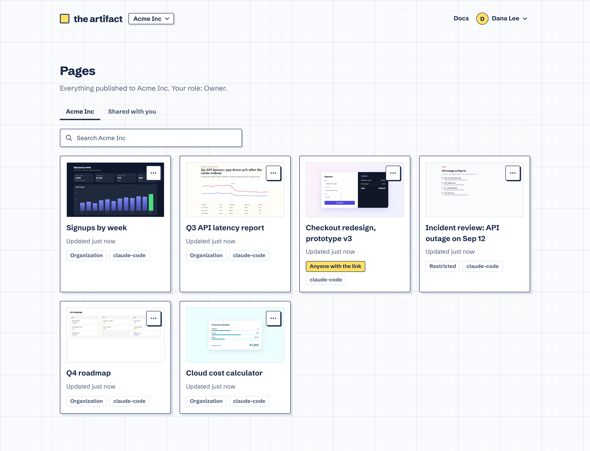
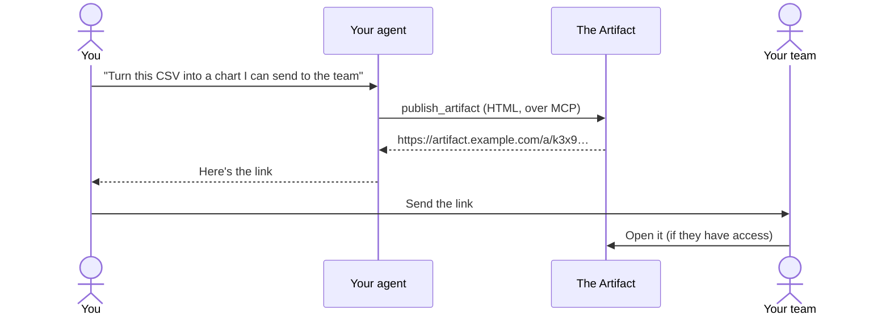
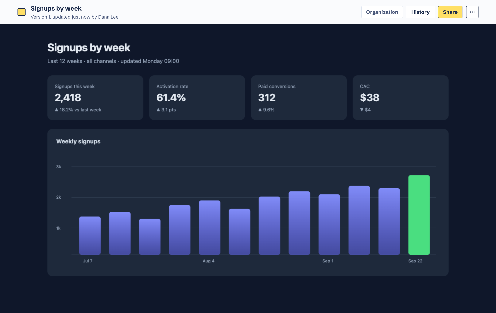
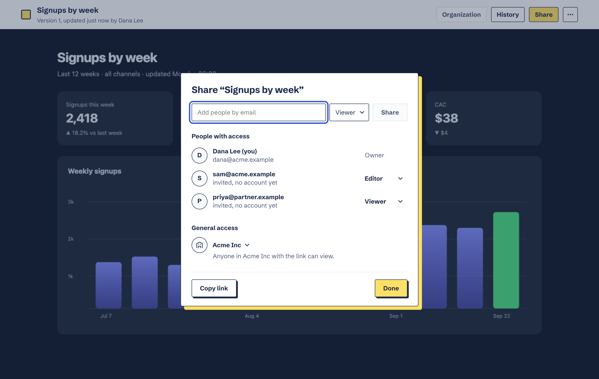

<div align="center">


# The Artifact

**Your agent writes the page. You send the link.**

Self-hosted hosting for the HTML pages coding agents build: reports, dashboards, prototypes, one-off tools.<br>
Claude Code, Cursor, Codex or any MCP client publishes a page and gets a link back. You choose who can open it.

[](https://github.com/andidev30/the-artifact/actions/workflows/ci.yml)
[](https://github.com/andidev30/the-artifact/releases)
[](https://github.com/andidev30/the-artifact/pkgs/container/the-artifact)
[](LICENSE)

[Quick start](#quick-start) · [Documentation](docs/introduction.md) · [Self-hosting](docs/self-hosting.md) · [Kubernetes](docs/kubernetes.md) · [Roadmap](https://github.com/users/andidev30/projects/2) · [Contributing](CONTRIBUTING.md)

<br>



</div>

## Why

Agents are good at making a page that explains something: a chart from a CSV, a report after an incident, a clickable prototype. Getting that page to someone else is the awkward part. You end up with an HTML file in a chat, a screenshot, or a one-off deploy.

The Artifact gives every page a link. The agent publishes over MCP, the page runs in a sandbox, and you decide who can open it: specific people, your organization, or anyone with the link. Ask for a change and the agent publishes a new version to the same link.

## How it works



1. **Connect your agent once.** Add The Artifact as an MCP server. The first time it publishes, your browser opens so you can sign in and pick a workspace.
2. **Ask for a page** in plain words. The agent writes the HTML and calls `publish_artifact`.
3. **Send the link.** Change requests publish new versions to the same address; the old ones stay in the history.

<table>
<tr>
<td width="50%"></td>
<td width="50%"></td>
</tr>
<tr>
<td><b>Pages run in a sandbox.</b> Scripts work, charts render, and nothing on the page can read your session or reach the app.</td>
<td><b>Share it like a doc.</b> Add people as viewers or editors by email, open it to your organization, or to anyone with the link.</td>
</tr>
</table>

## Features

- **One link per page, every version kept.** Republishing keeps the address; restore any older version from the history.
- **Single files or small sites.** A page can bring its own CSS, JavaScript, images, fonts and data, loaded by relative paths.
- **Private until you share it.** Restricted, organization-wide, or anyone with the link, plus people added by email.
- **Organizations** with owners, admins and members, invitations, and a shared gallery.
- **A gallery with real thumbnails,** rendered in headless Chromium that has no network of its own.
- **Works with any MCP client.** Streamable HTTP with OAuth 2.1 sign-in (PKCE, dynamic registration); setup steps for Claude Code, Cursor and Codex are in the docs.
- **Runs with or without email.** Without SMTP, people sign in with a password and admins pass sign-up links on by hand.
- **Passkeys and two-factor sign-in.** Sign in with a passkey, or add one or an authenticator app as a second factor, with recovery codes; organizations can require it. Account settings list your sessions.
- **Server admin area:** people, organizations, suspensions and the sign-up policy.
- **Small footprint.** One Docker image (amd64 and arm64), Postgres and any S3-compatible storage.

## Quick start

You need Docker with Docker Compose.

```sh
git clone https://github.com/andidev30/the-artifact
cd the-artifact/deploy/docker-compose
cp app.env.example app.env   # set APP_URL to the address people will use
cp .env.example .env         # passwords for the bundled Postgres and MinIO, the version to run
docker compose up -d         # pulls ghcr.io/andidev30/the-artifact at that version
```

Open http://localhost:8080 and create the first account; it becomes the admin of the server. Then connect your agent:

```sh
claude mcp add --transport http --scope user the-artifact http://localhost:8080/mcp
```

Other clients, HTTPS, email and backups are covered in [Self-hosting](docs/self-hosting.md). To build the image from the checkout instead, see [Building the image yourself](docs/self-hosting.md#building-the-image-yourself). For a cluster, see [Kubernetes](docs/kubernetes.md), which uses the same published image. Before updating, read the [changelog](CHANGELOG.md) and [Upgrading](docs/upgrading.md).

## MCP tools

| Tool | Does |
| --- | --- |
| `publish_artifact` | Publishes a page (or a new version of one), optionally into a folder, and returns its link |
| `list_artifacts` | Lists the most recently updated pages in the connected workspace, by title or folder, a batch at a time |
| `list_folders` | Lists the workspace's folders |
| `move_artifact` | Files a page into a folder, or takes it out |
| `get_artifact` | Reads a page's HTML and files, to edit it |
| `rename_artifact` | Renames a page |
| `set_artifact_visibility` | Restricted, organization, or anyone with the link |
| `share_artifact` | Shares a page with people by email |
| `delete_artifact` | Deletes a page (owner only) |
| `list_versions` | Lists a page's versions, as the history shows them |
| `restore_version` | Makes an older version current again |
| `download_artifact` | A link to download a page and its files as a zip |

Arguments and limits are in [Publishing pages](docs/publishing.md).

## Documentation

| Using it | Running it |
| --- | --- |
| [Introduction](docs/introduction.md) | [Install with Docker Compose](docs/self-hosting.md) |
| [Connect your agent](docs/connect-your-agent.md) | [Kubernetes](docs/kubernetes.md) |
| [Publishing pages](docs/publishing.md) | [Configuration reference](docs/configuration.md) |
| [Sharing and permissions](docs/sharing.md) | [Backup and restore](docs/backups.md) |
| [Organizations and members](docs/organizations.md) | [Security](docs/security.md) |
| [Version history](docs/version-history.md) | [Troubleshooting](docs/troubleshooting.md) |

The same pages are built into every install at `/docs`.

## Development

Node 26 and pnpm 11, plus Docker for the services.

```sh
pnpm install
pnpm services        # Postgres, MinIO (console http://localhost:9001) and Mailpit (http://localhost:8025)
cp apps/api/.env.example apps/api/.env
pnpm db:migrate
pnpm dev             # API on :3000, web on :5173
```

| Path | What |
| --- | --- |
| `apps/api` | Hono API, MCP server, OAuth server and thumbnail renderer |
| `apps/web` | React app, including the docs at `/docs` |
| `docs/` | The documentation, in Markdown |
| `deploy/` | Docker Compose and Kubernetes manifests |
| `e2e/` | Playwright end-to-end tests |

`pnpm lint` runs Biome and the type checks, `pnpm format` formats, `pnpm test` runs the unit and integration tests, and `pnpm test:e2e` the browser tests; see [TESTING.md](TESTING.md). `CLAUDE.md` files describe the conventions for people and coding agents alike, and `.claude/` holds shared Claude Code settings and project skills.

Contributions are welcome: what's planned is on the [project board](https://github.com/users/andidev30/projects/2); read [CONTRIBUTING.md](CONTRIBUTING.md) first, and report security issues privately as described in [SECURITY.md](SECURITY.md).

## License

The Artifact is free software under the [GNU Affero General Public License v3.0](LICENSE): self-host it, change it and share it. If you run a modified version as a service, share your changes too.

The code in `ee/` folders (`apps/api/src/ee`, `apps/web/src/ee`) powers only the hosted service (its marketing site, contact form and workspace choice) and is under the separate [Enterprise License](LICENSE-EE). A self-hosted install doesn't use it.
